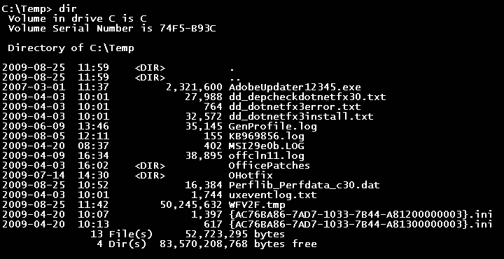

The command line interface (CLI) is a text-based interface that is used to operate software and operating systems while allowing the user to respond to visual prompts by typing single commands into the interface and receiving a reply in the same way.

CLI is quite different from the graphical user interface (GUI) that is presently being used in the latest operating systems.

A **command-line interface** or **command language interpreter** (**CLI**), also known as **command-line user interface**,**console user interface**, and **character user interface** (**CUI**), is a means of interacting with a computer program where the user (or client) issues commands to the program in the form of successive lines of text (command lines).

The CLI was the primary means of interaction with most computer systems until the introduction of the video display terminal in the mid-1960s, and continued to be used throughout the 1970s and 1980s on OpenVMS, Unix systems and personal computer systems including MS-DOS, CP/M and Apple DOS. The interface is usually implemented with a command line shell, which is a program that accepts commands as text input and converts commands to appropriate operating system functions.

Today, command-line interfaces to computer operating systems are much less widely used by computer users, who favor graphical user interfaces (GUIs). Command-line interfaces are often preferred by more advanced computer users, as they often provide a more concise and powerful means to control a program or operating system, and also because programs
with command-line interfaces are generally easier to automate via scripting. Command line interfaces for software other than operating systems include a number of programming languages such as Tcl/Tk, PHP and others, as well as utilities such as the compression utilities WinZip.

This is a view of MS-DOS from the command line:

