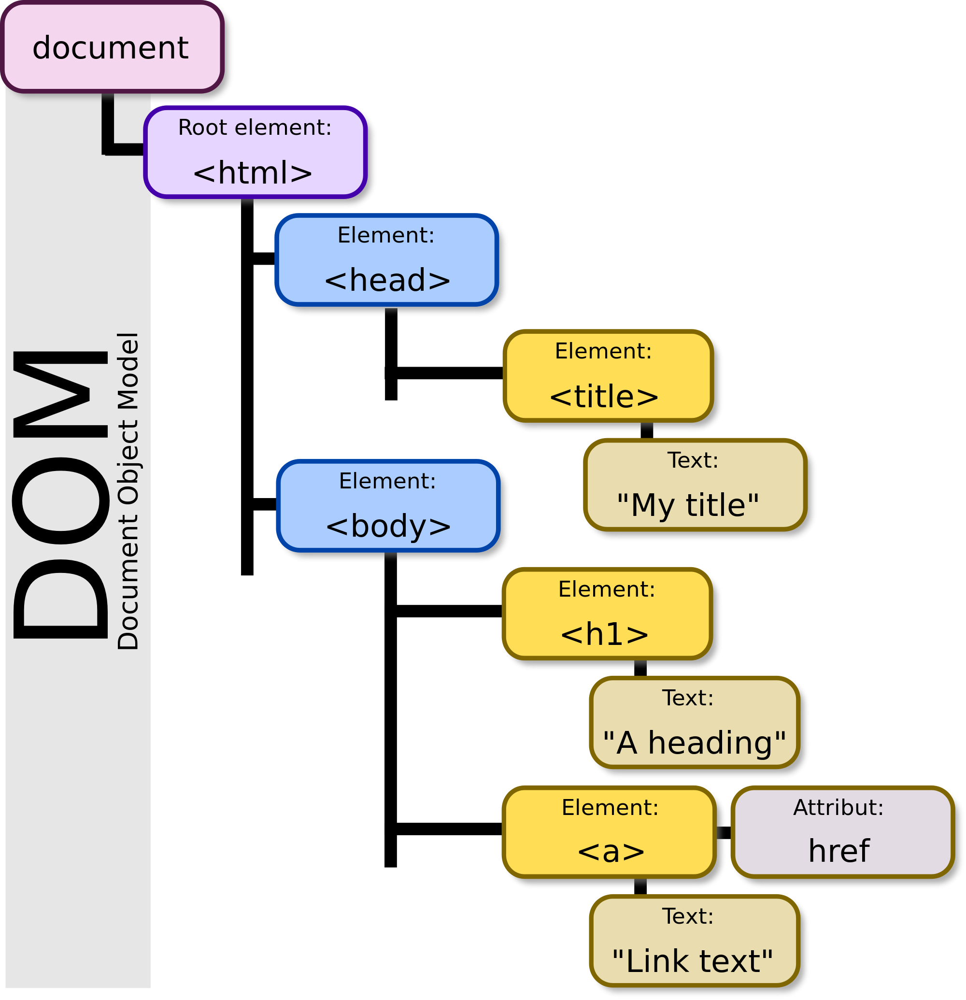
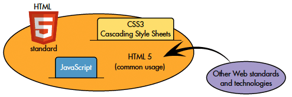

HTML stands for the HyperText Markup Language, which consists of a set of markup tags and are described by HTML tags. The development of HTML is widely attributed to Tim Berners-Lee, also known as the creator of the World Wide Web. In 1989, while working at CERN in Switzerland, he wrote a memorandum proposing for a hypertext system to be deployed on the Internet. (The original intent was to create a system under which researchers at CERN could share and collaborate on the production of documents across the laboratory's local area network. Owing to various conditions and constraints, Berners-Lee decided to construct his system on the basis of existing open technical standards; namely, the TCP/IP standard for addressing and data transport, and SGML, the Standard Generalized Markup Language, as the basis for the formulation of a simpler markup language for documents. These decisions proved to be of far-reaching consequence, imasmuch as Berners-Lee's system was, from the outset, fundamentally compatible with the core technologies of the Internet, and constructed in terms that would support enhancement and extension of the key protocols.) Berners-Lee then began to write server and browser software and developed a markup language for documents he called the Hypertext Markup Language, which derived the Standard Generalized Markup Language. (The Standard Generalized Markup Language (SGML; ISO 8879:1986) defines a generalized markup languages for documents. As defined in ISO 8879, generalized markup is based on two postulates:

* Markup should be declarative: it should describe a document's structure and other attributes, rather than specify the processing to be performed on it. Declarative markup is less likely to conflict with unforeseen future processing needs and techniques.
* Markup should be rigorous so that the techniques available for processing rigorously-defined objects like programs and databases can be used for processing documents as well.

SGML descended from IBM's Generalized Markup Language (GML), which was developed in the 1960s. As a document markup language, SGML was originally designed to enable the sharing of machine-readable large-project documents in government, law, and industry. SGML also was extensively applied by the military, and the aerospace, technical reference, and industrial publishing industries. The advent of the XML profile has made SGML suitable for widespread application for small-scale, general-purpose use.)

The first publicly available description of HTML was a document called "HTML Tags," first mentioned on the Internet by Tim Berners-Lee in late 1991. It describes 18 elements comprising the initial, relatively simple design of HTML. Except for the hyperlink tag, the elements described in this early draft were strongly influenced by `SGMLguid`, an in-house version of the SGML) that have been developed at CERN. 

Perhaps more to the point, Berners-Lee considered HTML to be an application of SGML -- his notion of the DTD, or document type definition -- had been derived from an SGML feature allowing simpler subsets of the markup language. It was formally defined as such by the Internet Engineering Task Force (IETF) in the 1993 publication of the first proposal for an HTML specification: "Hypertext Markup Language (HTML)" Internet-Draft by Berners-Lee and Dan Connolly, which included an SGML Document Type Definition to define the grammar. The draft expired after six months, but was notable for its acknowledgment of the NCSA Mosaic browser's custom tag for embedding in-line images, reflecting the IETF's philosophy of basing standards on successful prototypes. Similarly, Dave Raggett's competing Internet-Draft, "HTML+ (Hypertext Markup Format)", from late 1993, suggested standardizing already-implemented features like tables and fill-out forms. After the HTML and HTML+ drafts expired in early 1994, the IETF created an HTML Working Group, which in 1995 completed "HTML 2.0", the first HTML specification intended to be treated as a standard against which future implementations should be based.

Further development under the auspices of the IETF was slowed by competing interests. So, in 1996, the the World Wide Web Consortium (W3C) assumed responsibility for the  HTML specifications have been maintained, with input from commercial software vendors, by the World Wide Web Consortium (W3C).  HTML 4.01 was published in late 1999, with further errata published through 2001, and in 2000 HTML also became an international standard (ISO/IEC 15445:2000). In 2004, development began on HTML5 in the Web Hypertext Application Technology Working Group (WHATWG), which had been formed primarily by vendors to counter what was widely perceived as the slowness of W3C-directed development. HTML5 development became a joint project involving the W3C in 2008, not without ongoing controversies, and it was completed and standardized in 2014.

---

HTML5, which is intended to subsume not only HTML 4, but also XHTML 1 and DOM Level 2 HTML, is designed to improve the language with support for the latest multimedia, while keeping it easily readable by humans and consistently understood by computers and devices such as web browsers, parsers, etc. HTML5 
It includes detailed processing models to encourage more interoperable implementations; it extends, improves and rationalizes the markup available for documents, and introduces markup and application programming interfaces (APIs) for complex Web applications. (HTML5 is also useful in developing cross-platform mobile applications, because it includes features designed to support low-powered devices such as smartphones and tablets.) Many new syntactic features are included. To include and handle multimedia and graphical content natively, the new `<video>`, `<audio>` and `<canvas>` elements have been added, as well as support for scalable vector graphics (SVG) content and MathML for mathematical formulas. To enrich the semantic content of documents, new page structure elements such as `<main>`, `<section>`, `<article>`, `<header>`, `<footer>`, `<aside>`, `<nav>` and `<figure>`, have been added. New attributes are introduced, some elements and attributes have been removed, and others such as `<a>`, `<cite>` and `<menu>` have been changed, redefined or standardized. Finally, the APIs and Document Object Model (DOM) are now fundamental parts of the HTML5 specification and HTML5 also better defines the processing for any invalid documents. (The Document Object Model (DOM) is a cross-platform and language-independent convention for representing and interacting with objects in HTML, XHTML, and XML documents. The nodes of every document are organized in a tree structure, called the DOM tree. Objects in the DOM tree may be addressed and manipulated by using methods on the objects. The public interface of a DOM is specified in its application programming interface (API).) (An application programming interface (API) is a set of routines, protocols, and tools for building software and applications. An API expresses a software component in terms of its operations, inputs, outputs, and underlying types, defining functionalities that are independent of their respective implementations, which allows definitions and implementations to vary without compromising the interface. A well-constructed API makes it easier to develop a program by providing all the building blocks, which are then put together by the programmer. APIs typically come in the form of a library that includes specifications for routines, data structures, object classes, and variables. In other cases, notably SOAP and REST services, an API is simply a specification of remote calls exposed to the API consumers.
API specifications take many forms, including an International Standard, such as POSIX, vendor documentation, such as the Microsoft Windows API, or the libraries of a programming language, e.g. the Standard Template Library in C++ or the Java APIs. An API differs from an application binary interface (ABI) in that an API is source code-based while an ABI is a binary interface. For instance POSIX is an API, while the Linux Standard Base provides an ABI.)



## HTML Syntax

HTML tags are **keywords** (tag names) surrounded by **angle brackets**:

`<tagname>content</tagname>`

* HTML tags normally come **in pairs** like `<p>` and `</p>`
* The first tag in a pair is the **start tag,** the second tag is the **end tag**
* The end tag is written like the start tag, but with a **slash** before the tag name

In the syntax employed by the World Wide Web Consortium, the HTML element is everything from the start tag to the end tag:

`<p>My first HTML paragraph.</p>`

The start tag is often called the _opening_ tag. The end tag is often called the _closing_ tag.

## Basic Structure of an HTML File

All HTML documents must start with a type declaration: **`<!DOCTYPE html>`**. The HTML document itself begins with **`<html>`** and ends with **`</html>`**. The visible part of the HTML document is situated between **`<body>`** and **`</body>`**.

```c
<!DOCTYPE html>
<html>
<body>

<h1>My First Heading</h1>

<p>My first paragraph.</p>

</body>
</html>
```

## Basic HTML Tags

HTML headings are defined with the **`<h1\>`** to **`<h6>`** tags:

```c
<h1>This is a heading</h1>
<h2>This is a heading</h2>
<h3>This is a heading</h3>
```

HTML paragraphs are defined with the **`<p>`** tag:

```c
p>This is a paragraph.</p>
<p>This is another paragraph.</p>
```

HTML links are defined with the **`<a>`** tag:

```c
<a href="http://www.w3schools.com">This is a link</a>
```

HTML images are defined with the **``** tag.

The source file (**src**), alternative text (**alt**), and size (**width** and **height**) are provided as **attributes**:

``

HTML elements can have attributes, which provide additional information about an element. Attributes are always specified in **the start tag**, and come in `name/value pairs` like **name="value"**. 

As noted above, HTML links are defined with the <a> tag. The link address is specified in the `href` attribute:

`<a href="http://www.w3schools.com">This is a link</a>`

In the case of images, which are defined with the **``** tag, the filename of the source (**src**), and the size of the image (**width** and **height**) are all provided as **attributes**:

``

The HTML **`<br>`** element defines a **line break**. Use `<br>` if you want a line break, creating a new line, without starting a new paragraph:

\<p\>This is\<br\>a para\<br\>graph with line breaks\</p\>

## HTML Paragraphs

HTML documents including text are typically divided into paragraphs. The HTML **`<p>`** element defines a **paragraph**. See below:

\<p\>This is a paragraph\</p\>
\<p\>This is another paragraph\</p\>

### HTML Line Breaks

The HTML **`<br>`** element defines a **line break**. Use `<br>` if you want a line break (a new line) without starting a new paragraph:

\<p\>This is\<br\>a para\<br\>graph with line breaks\</p\>

### The HTML `<pre>` Element

The HTML `<pre>` element defines preformatted text. The text inside a `<pre>` element is displayed in a fixed-width font (usually Courier), and it preserves both spaces and line breaks:

\<pre\>
 My Bonnie lies over the ocean.

 My Bonnie lies over the sea.

 My Bonnie lies over the ocean.

 Oh, bring back my Bonnie to me.
\</pre\>

## HTML Links

## HTML Images

In HTML, images are defined with the `` tag. The `` tag is empty; it contains attributes only, and does not have a closing tag. The `src` attribute specifies the URL (web address) of the image:

\

The `alt` attribute specifies an alternate text for an image, if the image cannot be displayed. It provides alternative information for an image if a user for some reason cannot view it, e.g, because of a slow connection, an error in the `src` attribute, or if the user uses a screen reader. If a browser cannot find an image, it will display the alt text:

\

### Image Size - Width and Height

You can use the **style** attribute to specify the width and height of an image. In the example below, the values are specified in pixels (`px`):

\

Alternatively, you can use **width** and **height** attributes. Here, the values are specified in pixels by default:

\

Both the width, height, and style attributes are valid under the HTML5 standard. Use of the `style` attribute is recommended, because it prevents styles sheets from changing the original size of images:

\

## HTML Lists

## HTML Block and Inline Elements

Every HTML element has a default display value depending on what type of element it is. The default display value for most elements is block or inline. A block-level element always starts on a new line and takes up the full width available (stretches out to the left and right as far as it can). Examples of block-level elements:

* `<div>`
* `<h1>` - `<h6>`
* `<p>`
* `<form>`

An inline element does not start on a new line and only takes up as much width as necessary. Examples of inline elements include:

* `<span>`
* `<a>`
* ``

### The <div> Element

The `<div>` element is a block-level element that is often used as a container for other HTML elements.

The `<div>` element has no required attributes, but `style` and `clas`s are commonly used. When used together with CSS, the `<div>` element can be used to style blocks of content:

```c
<div style="background-color:black; color:white; padding:20px;">

<h2>London</h2>
<p>London is the capital city of England. It is the most populous city in the United Kingdom, with a metropolitan area of over 13 million inhabitants.</p>

</div>
```

### The `<span>` Element

The `<span>` element is an **inline element** that is often used as a container for some text.

The `<span>` element has no required attributes, but like the `<div>` tag, **style** and **class** are common employed.

When used together with CSS, the `<span>` element can be used to style parts of the text:

```c
<h1>My <span style="color:red">Important</span> Heading</h1>
```

## HTML Tables

## HTML Quotations

## HTML Computer Code

## HTML Classes

## Semantic HTML

Semantic HTML is a way of writing HTML that emphasizes the meaning of the encoded information over its presentation. HTML has included semantic markup from its inception, but has also included presentational markup, such as `<font>`, `<i>` and `<center>` tags. There are also the semantically neutral `<span>` and `<div>` tags. 

Since the late 1990s when mainstreamWeb browsers to support implementations of the Cascading Style Sheets specifications, Web authors have been encouraged to separate content and presentation, in the interests of building a version of the Web more conducive to the exploitation of semantic tagging. In a 2001 discussion of the so-called "Semantic Web," Berners-Lee and others gave examples of ways in which intelligent software "agents" might one day automatically crawl the Web and find, filter and correlate previously unrelated, published facts for the benefit of human users. Such agents are not yet commonplace, but some of the ideas of Web 2.0, mashups, and price comparison Websites may be coming close. The main difference between these Web applications and Berners-Lee's semantic agents lies in the fact that the current aggregation and hybridization of information is usually designed in by Web developers, who already know the  locations and the API semantics of the specific data they wish to mash, compare and combine. (An important type of Web agent that does crawl and read web pages automatically, without prior knowledge of what it might find, is the Web crawler or search-engine spider. These software agents are dependent on the semantic clarity of web pages they find as they use various techniques and algorithms to read and index millions of web pages a day and provide web users with search facilities without which the World Wide Web's usefulness would be greatly reduced. But in order for search-engine spiders to be able to rate the significance of pieces of text they find in HTML documents, the semantic structures that exist in HTML need to be widely and uniformly applied to bring out the meaning of published text.)

Good semantic HTML also improves the accessibility of Web documents; see the [Web Content Accessibility Guidelines](https://en.wikipedia.org/wiki/Web_Content_Accessibility_Guidelines). For example, when a screen reader or audio browser can ascertain the structure of a correctly marked document, it will not waste the visually impaired user's time by reading out repeated or irrelevant information.



