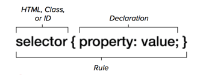

## ASSIGNMENTS

### Assignment 1: 

Download and install [Atom](https://atom.io/). Atom is an open source editor that may be run under Linux, Microsoft Windows, or OS X and supports a variety of syntaxes, including Markdown. The Atom Flight Manual is available at [Atom Flight Manual](http://flight-manual.atom.io/). Install the `pandoc-convert` package. (Pandoc is a free and open-source software document converter, widely used as a writing tool and as a basis for publishing workflows. Pandoc's most thoroughly supported file format is an extended version of Markdown, but it can also read many other forms of lightweight markup language, HTML, ReStructuredText, LaTeX, OPML, Org-mode, DocBook, and Office Open XML. For additional information, see the [Pandoc User's Guide](http://pandoc.org/README.html).) Pandoc can be used to create files in many more formats, including Office Open XML, OpenDocument, HTML, Wiki markup, InDesign ICML, web-based slideshows, ebooks, OPML, and various TeX formats (through which it can produce a PDF). It has built-in support for converting LaTeX mathematical equations to MathML and MathJax, among other formats.)


Using the Atom editor, compose a brief essay of circa 500 words describing the origins and evolution of the [Markdown](http://daringfireball.net/projects/markdown/) markup language.

Save the document as a Markdown file and transmit it as an email attachment to christomer@pitt.edu. Then, convert the contents of the file to the HTML format, using [Pandoc Online](http://pandoc.org/try/) or [Dingus](http://daringfireball.net/projects/markdown/dingus), save the new file as an `*.html` file, and upload the file via SFTP to the Web folder -- `~/userID/public/html/` -- on your CSSD account at unixs.cis.pitt.edu. If necessary, rename the HTML file to `index.html`. 


```c
<!doctype html>

<html lang="en">
<head>
  <meta charset="utf-8">

  <title>HTML5</title>
  <meta name="description" content="HTML5">
  <meta name="author" content="christomer">
</head>

<body>
  <h2>My Essay on Computing</h2
  <p>Opening Paragraph</p>
</body>
</html>
```


The next aspect of this assignment is to create an embedded Cascading Syle Sheet (CSS) for the HTML file. In the example below, rules have been established for the `<body>` of the document, using the selector `body` and set within the curly braces to establish margins on the left and right, the size of the font, and the `font-family`.

```c
<style>
body {
margin-left:50px;
margin-right:50px;
text-align:justify;
font-size:18px
font-family: Palatino ….
}
h2 {font-size:24px;
text-align:center;
color: purple;
}
</style>
```

You will note that the selector `h2` establishes formatting for any block encompassed by the `<h2></h2>` tags, and that this specification effectively overrides rules such as `font-size` and `text-align` that have been established previously for `body`.



To add the style sheet to the `*.html` file, you will once again need a text editor, placing the style sheet between the `<head></head>` tags. Assuming that you do not want to make any changes in the example style sheet displayed above, a copy-and-paste approach will suffice.

To add the style sheet to the `*.html` file, you will once again need a text editor, placing the style sheet between the `<head></head>` tags. Assuming that you do not want to make any changes in the example style sheet displayed above, a copy-and-paste approach will suffice.

Upload the file via SFTP to a Web folder called `markdown` -- `~/userID/public/html/markdown` -- on your CSSD account at unixs.cis.pitt.edu. If necessary, rename the HTML file to `index.html`. (The SFTP client you use should be able to create the folder called `markdown`. To create the folder manually, log onto `unixs.cis.pitt.edu` via SSH, navigate to your Web folder -- `~/userID/public/html` and issue the following command:

`$ mkdir markdown`

Open a Web browser and navigate to the Web page that you have uploaded to unixs.cis.pitt.edu. The URL should look like this: `http://www.pitt.edu/~ctomer/` with the userID assigned by CSSD substituting for ctomer in the expression above. (The Web server has been configured so that when a folder is addressed without specific reference to one of the `*.html` files within it, it will automatically serve the file called `index.html` should a file by that name be present.) 

Send the screenshot rendered in the *.png format to [christomer@pitt.edu](mailto:christomer@pitt.edu)


### Assignment 2:

Describe the organizational structure of the operating system on the computer that you use primarily, e.g., Microsoft Windows, OS X, Linux, etc., from the `root` of the file system and including application and user directories. The report should be 300-500 words in length and should include original illustrations created via Gravit or a similar application.  


The URL for Gravit is [https://gravit.io/](https://gravit.io/).

The report should be written in Markdown, exported to HTML, and formatted with the `*.css` file described above, with the following amendment:

```c
img.displayed {
    display: block;
    margin-left: auto;
    margin-right: auto }
```

The CSS code above creates a class that will center an image file when the class is invoked. Application of the CSS class is as follows:

``

Upload the file via SFTP to a Web folder called `os_report' -- `~/userID/public/html/os_report` -- on your CSSD account at unixs.cis.pitt.edu. If necessary, rename the HTML file to `index.html`. Send the Markdown version of the file to [christomer@pitt.edu](mailto:christomer@pitt.edu).

### Key Resources

[How to Use SFTP to Securely Transfer Files with a Remote Server](https://www.digitalocean.com/community/tutorials/how-to-use-sftp-to-securely-transfer-files-with-a-remote-server)

[Learn Atom: the Basics](https://www.lynda.com/Web-Development-tutorials/Learn-Atom-Basics/468147-2.html?org=pitt.edu)

[SSH and FTP for Remote Administration](https://youtu.be/o-W_mDGX1bY)

[Understanding FTP](http://www.lynda.com/FTP-tutorials/Understanding-FTP/189068-2.html?org=pitt.edu)

[Understanding SSH](http://www.lynda.com/Developer-Network-Administration-tutorials/Understanding-SSH/189066-2.html?org=pitt.edu)

[Up and Running with Markdown](https://www.lynda.com/Web-Development-tutorials/Up-Running-Markdown/438888-2.html?org=pitt.edu)

[What is SFTP, and how do I use it to transfer files?](https://kb.iu.edu/d/akqg)