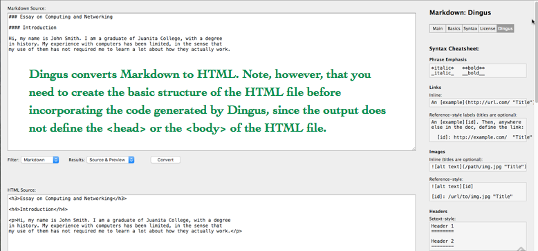

## Topics:

* Key Internet Protocols
* Operating Systems and File Management
* Working from the Command Line under Linux, Microsoft Windows, and OS X
* Text Processing/Markup
* Image Processing

### Assignments

Download and install [Atom](https://atom.io/). Atom is an open source editor that may be run under Linux, Microsoft Windows, or OS X and supports a variety of syntaxes, including Markdown. The Atom Flight Manual is available at [Atom Flight Manual](http://flight-manual.atom.io/). Install the `pandoc-convert` package. (Pandoc is a free and open-source software document converter, widely used as a writing tool and as a basis for publishing workflows. Pandoc's most thoroughly supported file format is an extended version of Markdown, but it can also read many other forms of lightweight markup language, HTML, ReStructuredText, LaTeX, OPML, Org-mode, DocBook, and Office Open XML. For additional information, see the [Pandoc User's Guide](http://pandoc.org/README.html).) Pandoc can be used to create files in many more formats, including Office Open XML, OpenDocument, HTML, Wiki markup, InDesign ICML, web-based slideshows, ebooks, OPML, and various TeX formats (through which it can produce a PDF). It has built-in support for converting LaTeX mathematical equations to MathML and MathJax, among other formats.)


Using the Atom editor, compose a brief essay of circa 500 words describing your experiences in the use of computers and networks, accounting for aspects of computing and networking that you know well, and indicating the areas in which you would like to increase your knowledge and skills.

Save the document as a Markdown file and transmit it as an email attachment to christomer@pitt.edu. Then, convert the contents of the file to the HTML format, using [Pandoc Online](http://pandoc.org/try/) or [Dingus](http://daringfireball.net/projects/markdown/dingus), save the new file as an `*.html` file, and upload the file via SFTP to the Web folder -- `~/userID/public/html/` -- on your CSSD account at unixs.cis.pitt.edu. If necessary, rename the HTML file to `index.html`. 



```c
<!doctype html>

<html lang="en">
<head>
  <meta charset="utf-8">

  <title>HTML5</title>
  <meta name="description" content="HTML5">
  <meta name="author" content="christomer">
</head>

<body>
  <h2>My Essay on Computing</h2
  <p>Opening Paragraph</p>
</body>
</html>
```

