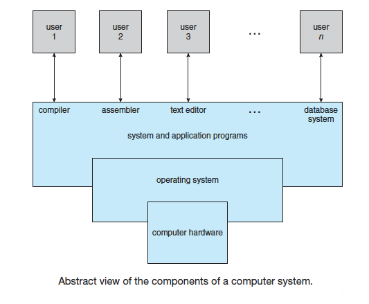
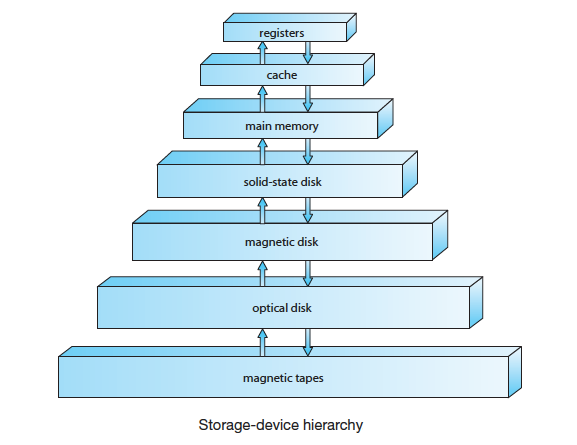
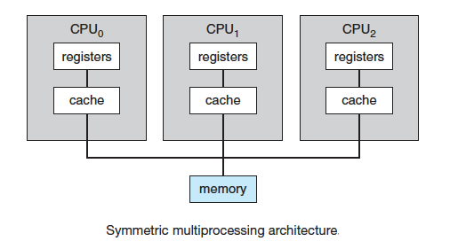
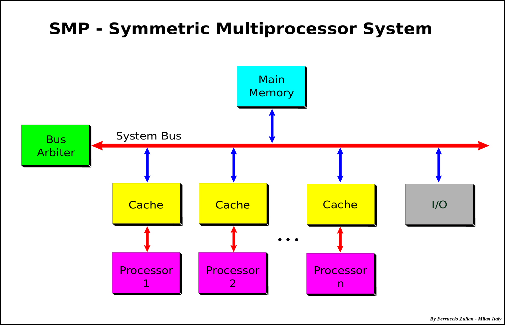

## Purposes of an Operating System

The three main purposes of an operating system are:

• To provide an environment for a computer user to execute programs on computer hardware in a convenient and efficient manner.

• To allocate the separate resources of the computer as needed to solve the problem given. The allocation process should be as efficient as possible.

• As a control program it serves two major functions: (1) supervision of the execution of user programs to prevent errors and improper use of the computer, and (2) management of the operation and control of I/O devices.

A computer system can be divided roughly into four components: the hardware, the operating system, the application programs, and the users. The hardware—the central processing unit (CPU), the memory, and the input/output (I/O) devices—provides the basic computing resources for the system. The application programs—such as word processors, spreadsheets, compilers, and Web browsers—define the ways in which these resources are used to solve users’ computing problems. The operating system controls the hardware and coordinates its use among the various application programs for the various users.

From the computer’s point of view, the operating system is the program most intimately involved with the hardware. In this context, we can view an operating system as a resource allocator. A computer system has many
resources that may be required to solve a problem: CPU time, memory space, file-storage space, I/O devices, and so on. The operating system acts as the
manager of these resources. Facing numerous and possibly conflicting requests for resources, the operating system must decidehow to allocate them to specific programs and users so that it can operate the computer system efficiently and fairly. Resource allocation is especially important where many users access the same mainframe or minicomputer.

A slightly different view of an operating system emphasizes the need to
control the various I/O devices and user programs. An operating system is a
control program. A control program manages the execution of user programs
to prevent errors and improper use of the computer. It is especially concerned with the operation and control of I/O devices.

## Computer System Operations

A modern general-purpose computer system consists of one or more CPUs
and a number of device controllers connected through a common bus that
provides access to shared memory. Each device controller is in charge of a specific type of device (for example, disk drives, audio devices, or video displays). The CPU and the device controllers can execute in parallel,
competing for memory cycles. To ensure orderly access to the shared memory,
a memory controller synchronizes access to the memory.

For a computer to start running — for instance, when it is powered up or rebooted — it needs to have an initial program to run. This initial program,
or bootstrap program, tends to be simple. Typically, it is stored within
the computer hardware in read-only memory (ROM) or electrically erasable
programmable read-only memory (EEPROM), known by the general term
firmware. It initializes all aspects of the system, from CPU registers to device controllers tomemorycontents. The bootstrap program must know how to load the operating system and how to start executing that system. To accomplish this goal, the bootstrap program must locate the operating-system kernel and load it into memory.

Once the kernel is loaded and executing, it can start providing services to the system and its users. Some services are provided outside of the kernel, by system programs that are loaded into memory at boot time to become system processes, or system daemons that run the entire time the kernel is running. On UNIX, the first system process is “init,” and it starts many other daemons. Once this phase is complete, the system is fully booted, and the system waits for some event to occur.

The occurrence of an event is usually signaled by an interrupt from either the hardware or the software. Hardware may trigger an interrupt at any time by sending a signal to the CPU, usually by way of the system bus. Software may trigger an interrupt by executing a special operation called a system call
(also called a monitor call).

When the CPU is interrupted, it stops what it is doing and immediately transfers execution to a fixed location. The fixed location usually contains the starting address where the service routine for the interrupt is located. The interrupt service routine executes; on completion, the CPU resumes the interrupted computation. 

Interrupts are an important part of a computer architecture. Each computer
design has its own interrupt mechanism, but several functions are common. The interrupt must transfer control to the appropriate interrupt service routine.
The straightforward method for handling this transfer would be to invoke a generic routine to examine the interrupt information. The routine, in turn, would call the interrupt-specific handler. However, interrupts must be handled quickly. Since only a predefined number of interrupts is possible, a table of pointers to interrupt routines can be used instead to provide the necessary speed. The interrupt routine is called indirectly through the table, with no intermediate routine needed. Generally, the table of pointers is stored in low memory (the first hundred or so locations). These locations hold the addresses of the interrupt service routines for the various devices. This array, or interrupt vector, of addresses is then indexed by a unique device number, given with the interrupt request, to provide the address of the interrupt service routine for the interrupting device. Operating systems as different as Windows and UNIX dispatch interrupts in this manner.

The interrupt architecture must also save the address of the interrupted
instruction. Many old designs simply stored the interrupt address in a
fixed location or in a location indexed by the device number. More recent
architectures store the return address on the system stack. If the interrupt
routine needs to modify the processor state—for instance, by modifying
register values—it must explicitly save the current state and then restore that
state before returning. After the interrupt is serviced, the saved return address is loaded into the program counter, and the interrupted computation resumes as though the interrupt had not occurred.

## Storage Definitions and Notation

The basic unit of computer storage is the bit. A bit can contain one of two
values, 0 and 1\. All other storage in a computer is based on collections of bits. Given enough bits, it is amazing how many things a computer can represent: numbers, letters, images, movies, sounds, documents, and programs, to name a few. A byte is 8 bits, and on most computers it is the smallest convenient chunk of storage. For example, most computers don’t have an instruction to move a bit but do have one to move a byte. A less common term is word, which is a given computer architecture’s native unit of data. A word is made up of one or more bytes. For example, a computer that has 64-bit registers and 64-bit memory addressing typically has 64-bit (8-byte) words. A computer executes many operations in its native word size rather than a byte at a time. Computer storage, along with most computer throughput, is generally
measured and manipulated in bytes and collections of bytes. A kilobyte, or KB, is 1,024 bytes; a megabyte, or MB, is 1,0242 bytes; a gigabyte, or GB, is
1,0243 bytes; a terabyte, or TB, is 1,0244 bytes; and a petabyte, or PB, is 1,0245 bytes. Computer manufacturers often round off these numbers and say that a megabyte is 1 million bytes and a gigabyte is 1 billion bytes. Networking measurements are an exception to this general rule; they are given in bits (because networks move data a bit at a time).

## Storage Structure

The CPU can load instructions only from memory, so any programs to run must be stored there. General-purpose computers run most of their programs from
rewritable memory, called main memory (also called random-access memory, or RAM). Main memory commonly is implemented in a semiconductor technology called dynamic random-access memory (DRAM).

Computers use other forms of memory as well. There is read-only memory, ROM, and electrically erasable programmable read-only memory, EEPROM). Because ROM cannot be changed, only static programs, such as the bootstrap program described earlier, are stored there. The immutability of ROM is of use in game cartridges. EEPROM can be changed but cannot be changed frequently and so contains mostly static programs. For example, smartphones have EEPROM to store factory-installed programs.

All forms of memory provide an array of bytes. Each byte has its own address. Interaction is achieved through a sequence of load or store instructions to specific memory addresses. The load instruction moves a byte or word frommain memory to an internal register within the CPU, whereas the store instruction moves the content of a register to main memory. Aside from explicit loads and stores, the CPU automatically loads instructions from main memory for execution.

A typical instruction–execution cycle, as executed on a system with a von Neumann architecture, first fetches an instruction from memory and stores that instruction in the instruction register. The instruction is then decoded and may cause operands to be fetched from memory and stored in some internal register. After the instruction on the operands has been executed, the result may be stored back in memory. Notice that the memory unit sees only a stream of memory addresses. It does not know how they are generated (by the instruction counter, indexing, indirection, literal addresses, or some other means) or what they are for (instructions or data). Accordingly, we can ignore how a memory address is generated by a program. We are interested only in the sequence of memory addresses generated by the running program.

Ideally, we want the programs and data to reside in main memory permanently. This arrangement usually is not possible for the following two reasons:

* Main memory is usually too small to store all needed programs and data
permanently.

* Main memory is a volatile storage device that loses its contents when
power is turned off or otherwise lost.

Thus, most computer systems provide secondary storage as an extension of main memory. The main requirement for secondary storage is that it be able to
hold large quantities of data permanently.

The most common secondary-storage device is a magnetic disk, which
provides storage for both programs and data. Most programs (system and
application) are stored on a disk until they are loaded into memory. Many
programs then use the disk as both the source and the destination of their
processing. Hence, the proper management of disk storage is of central importance to a computer system. In a larger sense, however, the storage structure that we have described — consisting of registers, main memory, and magnetic disks — is only one of many possible storage systems. Others include cache memory, CD-ROM, magnetic tapes, and so on. Each storage system provides the basic functions of storing a datum and holding that datum until it is retrieved at a later time. The main
differences among the various storage systems lie in speed, cost, size, and
volatility.

The wide variety of storage systems can be organized in a hierarchy according to speed and cost. The higher levels are expensive, but they are fast. As we move down the hierarchy, the cost per bit generally decreases, whereas the access time generally increases. This trade-off is reasonable; if a given storage system were both faster and less expensive than another — other
properties being the same — then there would be no reason to use the slower, more expensive memory. In fact, many early storage devices, including paper 
tape and core memories, are relegated to museums now that magnetic tape and semiconductor memory have become faster and cheaper. The top four levels of memory, as in the figure above, may be constructed using semiconductor memory. In addition to differing in speed and cost, the various storage systems are either volatile or nonvolatile. As noted earlier, volatile storage loses its contents when the power to the device is removed. In the absence of expensive battery and generator backup systems, data must be written to nonvolatile storage for safekeeping. In the hierarchy shown above, the storage systems above the solid-state disk are volatile, whereas those including the solid-state disk and below are nonvolatile. Solid-state disks have several variants but in general are faster than magnetic disks and are nonvolatile. One type of solid-state disk stores data in a large DRAM array during normal operation but also contains a hidden magnetic hard disk and a battery for backup power. If external power is interrupted, this solid-state disk’s controller copies the data from RAM to the magnetic disk. When external power is restored, the controller copies the data back into RAM. Another form of solid-state disk is flash memory, which is popular in cameras and personal digital assistants (PDAs), in robots, and increasingly for storage on general-purpose computers. Flash memory is slower than DRAM but needs no power to retain its contents. Another form of nonvolatile storage is NVRAM, which is DRAM with battery backup power. This memory can be as fast as DRAM and (as long as the battery lasts) is nonvolatile.

The design of a complete memory system must balance all the factors discussed previously: it must use only as much expensive memory as necessary while providing as much inexpensive, nonvolatile memory as possible. Caches can be installed to improve performance where a large disparity in access time or transfer rate exists between two components 

## I/O Structure

Storage is only one of many types of I/O devices within a computer. A large portion of operating system code is dedicated to managing I/O, both because of its importance to the reliability and performance of a system and because of the varying nature of the devices. 

Next, we provide an overview of I/O.

A general-purpose computer system consists of CPUs and multiple device controllers that are connected through a common bus. Each device controller is in charge of a specific type of device. Depending on the controller, more than one device may be attached. For instance, seven or more devices can be attached to the small computer systems interface (SCSI) controller. A device controller maintains some local buffer storage and a set of special-purpose registers. The device controller is responsible for moving the data between the peripheral devices that it controls and its local buffer storage. Typically, operating systems have a device driver for each device controller. This device driver understands the device controller and provides the rest of the operating system with a uniform interface to the device. To start an I/O operation, the device driver loads the appropriate registers within the device controller. The device controller, in turn, examines the contents of these registers to determine what action to take (such as “read a character from the keyboard”). The controller starts the transfer of data from the device to its local buffer. Once the transfer of data is complete, the device controller informs the device driver via an interrupt that it has finished its operation. The device driver then returns control to the operating system, possibly returning the data or a pointer to the data if the operation was a read. For other operations, the device driver returns status information. This form of interrupt-driven I/O is fine for moving small amounts of data but can produce high overhead when used for bulk data movement such as disk I/O. To solve this problem, direct memory access (DMA) is used. After setting up buffers, pointers, and counters for the I/O device, the device controller
transfers an entire block of data directly to or from its own buffer storage to memory, with no intervention by the CPU. Only one interrupt is generated per block, to tell the device driver that the operation has completed, rather than the one interrupt per byte generated for low-speed devices. While the device controller is performing these operations, the CPU is available to accomplish other work. Some high-end systems use switch rather than bus architecture. On these systems, multiple components can talk to other components concurrently, rather than competing for cycles on a shared bus. In this case, DMA is even more effective. 

## Computer System Architecture

## Single Processor Systems

## Multiprocessor Systems

Multiprocessor systems (also known as parallel systems or multicore systems) have come to dominate the landscape of
computing. Such systems have two or more processors in close communication,
sharing the computer bus and sometimes the clock, memory, and peripheral
devices. Multiprocessor systems first appeared prominently appeared in
servers and have since migrated to desktop and laptop systems. Recently,
multiple processors have appeared on mobile devices such as smartphones
and tablet computers.

Multiprocessor systems have three main advantages:

* _Increased throughput_. By increasing the number of processors,we expect
to get more work done in less time. The speed-up ratio with N processors
is not N, however; rather, it is less than N. When multiple processors
cooperate on a task, a certain amount of overhead is incurred in keeping
all the parts working correctly. This overhead, plus contention for shared
resources, lowers the expected gain from additional processors. Similarly,
N programmers working closely together do not produce N times the amount of work a single programmer would produce.
* _Economy of scale_. Multiprocessor systems can cost less than equivalent
multiple single-processor systems, because they can share peripherals,
mass storage, and power supplies. If several programs operate on the
same set of data, it is cheaper to store those data on one disk and to have all the processors share them than to have many computers with local
disks and many copies of the data.
* _Increased reliability_. If functions can be distributed properly among
several processors, then the failure of one processor will not halt the
system, only slow it down. If we have ten processors and one fails, then
each of the remaining nine processors can pick up a share of the work of
the failed processor. Thus, the entire system runs only 10 percent slower,
rather than failing altogether.

Increased reliability of a computer system is crucial in many applications.
The ability to continue providing service proportional to the level of surviving hardware is called graceful degradation. Some systems go beyond graceful degradation and are called fault tolerant, because they can suffer a failure of any single component and still continue operation. Fault tolerance requires a mechanism to allow the failure to be detected, diagnosed, and, if possible, corrected. The HP NonStop (formerly Tandem) system uses both hardware and software duplication to ensure continued operation despite faults. The system consists of multiple pairs of CPUs, working in lockstep. Both processors in the pair execute each instruction and compare the results. If the results differ, then
one CPU of the pair is at fault, and both are halted. The process that was being executed is then moved to another pair of CPUs, and the instruction that failed is restarted. This solution is expensive, since it involves special hardware and considerable hardware duplication. The multiple-processor systems in use today are of two types. Some systems use asymmetric multiprocessing, in which each processor is assigned a specific task.Aboss processor controls the system; the other processors either look to the boss for instruction or have predefined tasks. This scheme defines a boss–worker relationship. The boss processor schedules and allocates work to the worker processors. The most common systems use symmetric multiprocessing (SMP), in which each processor performs all tasks within the operating system. SMP means that all processors are peers; no boss–worker relationship exists between processors.

The figure above illustrates a typical SMP architecture. Notice that each processor has its own set of registers, as well as a private—vor local—cache. However, all processors share physical memory. An example of an vSMP system is AIX, a commercial version of UNIX designed by IBM. An AIX system can be configured to employ dozens of processors. The benefit of this model is that many processes can run simultaneously — N processes can run if there are N CPUs — without causing performance to deteriorate significantly. However, we must carefully control I/O to ensure that the data reach the appropriate processor. Also, since the CPUs are separate, one may be sitting
idle while another is overloaded, resulting in inefficiencies. These inefficiencies can be avoided if the processors share certain data structures. A multiprocessor system of this form will allow processes and resources — such as memory — to be shared dynamically among the various processors and can lower the variance among the processors. Such a system must be written carefully. Virtually all modern operating systems — including Windows, Mac OS X, and Linux — now provide support for SMP.

## Blade Servers

Blade servers are a relatively recent development in which multiple processor boards, I/O boards, and networking boards are placed in the same chassis. The difference between these and traditional multiprocessor systems is that each blade-processor board boots independently and runs its own operating system. Some blade-server boards are multiprocessor as well, which blurs the lines between types of computers. In essence, these servers consist of multiple independent multiprocessor systems.

## Command Interpreters

What is the purpose of the command interpreter and why is it usually separate from the kernel? The answer is that the command interpreter reads commands from the user or from a file of commands and executes them, usually by turning them into one or more system
calls. It is usually not part of the kernel since the command interpreter
is subject to changes.

What system calls have to be executed by a command interpreter or shell in order to start a new process? In UNIX or Linux systems, a fork system call followed by an exec system call need to be performed to start a new process. The fork call clones the currently executing process, while the exec call overlays a new process based on a different executable over the calling process.