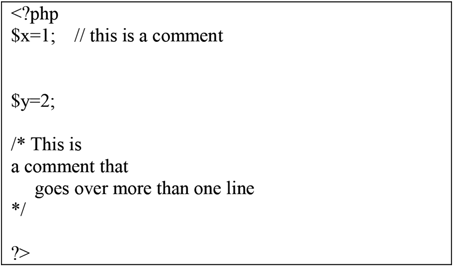
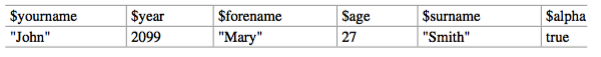
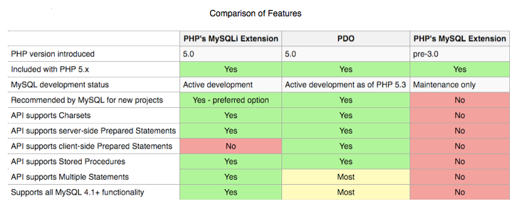

a PHP scripting block comprises a sequence of PHP statements (sometimes also called 'instructions') starting with an opening PHP tag `<?php` and ending with a closing PHP tag `?>`. The letters php in the opening tag can be written in any combination of upper and lower case. This is a simple example of a PHP script comprising only a single statement.

```c
  <?php
  print "Hello World";
  ?>
```

### Blank Lines and Layout

Blank lines in a PHP script are ignored altogether. PHP is also liberal about the use of tabs and spaces within statements to improve the readability of a script. They can be placed anywhere that most people would be likely to consider reasonable, but not inside the names of variables, arrays or functions (all to be defined later) or inside system keywords such as 'Print'. It is probably easiest to experiment to find out what is permitted rather than memorise a precise specification. The examples in this book will help to illustrate what is considered reasonable usage.

### Comments

Two types of comment are permitted in PHP scripts: 

Single-line comments: Two consecutive slash characters `//` on a line indicate that those characters and everything that follows on the same line is to be treated as a comment and ignored. A single-line comment can alternatively begin with a hash`#` character.

Multi-line comments: Comments that go over more than one line are permitted. The character combinations `/*` and `*/` are used to signify the start and end, respectively, of a multi-line comment.



The opening and closing PHP tags are normally placed on separate lines. This is recommended as standard practice in the interests of clarity. However PHP is flexible and a programmer can choose whether to write even a small scripting block as a single line such as

```c
<?php print "Hello, World"; ?>
```

An alternative would be:

```c
<?php
print "Hello, World";

?>
```

### How a 'Mixed' PHP File Is Processed

The effect of pointing the Web browser to a PHP file with a mixture of HTML and PHP is to make the following sequence of events occur: 

* If the file begins with HTML text, everything up to but not including the next `<?php` tag is passed to the browser unchanged and displayed on the user's screen in the usual way.
* Once a `<?php` tag is encountered everything between it and the next `?>` tag is treated as a sequence of PHP statements. These are performed or executed one by one. This can have many possible effects, such as giving values to variables and updating a database, but the only ones that directly affect the web browser are when a print statement is executed. The resulting string of characters is passed to the web browser as if it had been entered as HTML.
* After the closing PHP tag is encountered any following lines are treated as HTML once again and are passed to the browser unaltered until any further opening PHP tag is found and so on. 

Once this process is completed the Web browser displays the HTML it has been given (including HTML code generated by PHP) in the form of a Webpage, in the usual way.

### PHP’s Basic Components

#### Variables

A basic feature of all but the simplest scripts is the manipulation of one or more variables. A variable is a part of the computer's memory that can be used to store a value. A set of variables can be thought of as a set of boxes or pigeonholes, each labelled with the name of one of the variables. 

In PHP the name of a variable must start with a dollar sign, which is followed by a sequence of one or more upper case letters, lower case letters, digits and/or underscores. The character immediately after the `$` sign must not be a digit. 

A programmer has the option of using long, meaningful variable names such as `$the_occupation_of_my_father` or short names such as `$x`, or something in between.



When a variable is given a value (or 'assigned a value') for the first time, a pigeonhole with its name is created and the value is entered. Subsequently the value in the pigeonhole may be replaced by a different value by another assignment (the previous value being destroyed). This can happen an unlimited number of times.

A variable such as $x can be given a value by an assignment statement such as

```c
$x = "this is an example of a string’:
```

```c
$x = 33.15;
```

```c
$x =$x + 100;
```

The `=` sign in an assignment statement should be read as 'is set to', so variable `$x` is set to the value 27.4, etc. Note that a variable can appear on both sides of an assignment, so the final example should be read as 'variable `$x` is set to the existing value of `$x` plus 100'.

#### Uninitialized Variables

If a script refers to a variable which has never been given a value, called an uninitialized variable, this does not cause an error to occur. If the context expects a numerical value it will be assumed that an uninitialized variable has the value zero. If a string value is needed it will be assumed to be `""`, i.e. a pair of double quotes with nothing inside them, which is called a null string or an empty string.

#### Variable Names

#### Declaration 

Every PHP class, interface, function, and constant lives beneath a namespace (or sub‐ namespace). Namespaces are declared at the top of a PHP file on a new line immedi‐ ately after the opening `<?php` tag. The namespace declaration begins with namespace, then a space character, then the namespace name, and then a closing semicolon `;` character. 

Remember, too, that namespaces are often used to establish a top-level name. In the example below, the namespace declaration establishes the SIS name: 

```c
\<?php
 namespace SIS; 
```

All PHP classes, interfaces, functions, or constants declared beneath this namespace declaration live in the SIS namespace and are, in some way, related to SIS. If we want to organize related code, then we would use a subname‐space. 

In declaring subnamespaces, the only difference is that the namespace and subnamespace names are separated with the `\\` character. The following example declares a subnamespace named LIS2600 that lives beneath the topmost SIS namespace: 

```c
\<?php
 namespace SIS\\LIS2600; 
```

All classes, interfaces, functions, and constants declared beneath this namespace declaration live in the `SIS\\LIS2600` subnamespace. 

All classes in the same namespace or subnamespace don’t have to be declared in the same PHP file. You can specify a namespace or subnamespace at the top of any PHP file, and that file’s code becomes a part of that namespace or subnamespace. This makes it possible to write multiple classes in separate files that belong to a common namespace.

#### Global namespace

If you reference a class, interface, function, or constant without a namespace, PHP assumes the class, interface, function, or constant lives in the current namespace. If this assumption is wrong, PHP attempts to resolve the class, interface, function, or constant. If you need to reference a namespaced class, interface, function, or constant inside another namespace, you must use the fully qualified PHP class name (`name‐ space + class name`). You can type the fully qualified PHP class name, or you can import the code into the current namespace with the use keyword. 

Some code might not have a namespace and, therefore, lives in the global namespace. The native Exception class is a good example. You can reference globally namespaced code inside another namespace by prepending a `\\` character to the class, interface, function, or constant name. For example, the `\\My\\App\\Foo::doSomething()` method below fails because PHP searches for a `\\My\\App\\Exception` class that does not exist.

```c
<?php
namespace My\App;

class Foo {

public function doSomething() {

$exception = new Exception(); }

} 
```

Instead, add a `\\` prefix to the Exception class name, as shown in below. This tells PHP to look for the Exception class in the global namespace instead of the cur‐ rent namespace.

```c
<?php
namespace My\App;

class Foo {

public function doSomething() {

throw new \Exception(); }

} 
```

```sequence
Title: Here is a title
A->B: Normal line
B-->C: Dashed line
C->>D: Open arrow
D-->>A: Dashed open arrow
```

### Configuring a Web Server for PHP

### Communicating with the Database from PHP Scripts

PHP doesn’t understand SQL, but it doesn’t need to: PHP just establishes a connection with the MySQL server and sends the SQL message over the con- nection. The MySQL server interprets the SQL message, follows the instruc- tions, and sends a return message that states its status and what it did (or reports an error if it couldn’t understand or follow the instructions). 

The PHP language provides functions that make communicating with MySQL extremely simple. You use PHP functions to send SQL queries to the database. You don’t need to know the details of communicating with MySQL; PHP handles the details. You only need to know the SQL queries and how to use the PHP functions.

PHP provides two sets of functions for communicating with MySQL — the `mysql` functions and the `mysqli` (MySQL Improved) functions. Which functions you use depends on the version of MySQL and PHP you’re using. The `mysqli` functions were added in PHP 5 for use with MySQL versions 4.1 and later. (All that follows here assumes that PHP 5, or higher, is in place.)

(The MySQLi Extension (MySQL Improved) is a relational database driver used in the PHP programming language to provide an interface with MySQL databases. There are three main API options when considering connecting to a MySQL database server: (1) PHP's MySQL Extension; (2) the MySQLi Extension; and (3) the PHP Data Objects (PDO).
The PHP code consists of a core, with optional extensions to the core functionality. PHP's MySQL-related extensions, such as the MySQLi extension, and the MySQL extension, are implemented using the PHP extension framework. An extension typically exposes an API to the PHP programmer, to allow its facilities to be used programmatically. However, some extensions which use the PHP extension framework do not expose an API to the PHP programmer. The PDO MySQL driver extension, for example, does not expose an API to the PHP programmer, but provides an interface to the PDO layer above it. MySQLi is an improved version of the older PHP MySQL driver, offering various benefits; the developers of the PHP programming language recommend using MySQLi when dealing with MySQL server versions 4.1.3 and newer.)

