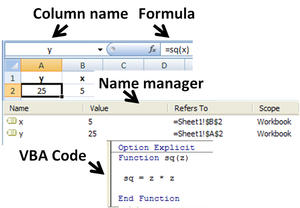
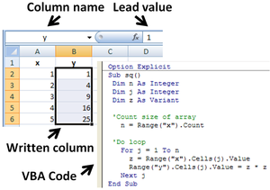

A **spreadsheet** is an interactive computer application for organization, analysis and storage of data in tabular form. Spreadsheets were developed as computerized simulations of paper accounting worksheets. The program operates on data entered in cells of an array, organized in rows and columns. Each cell of the array may contain either numeric or text data, or the results of formulas that automatically calculate and display a value based on the contents of other cells.

Spreadsheet users may adjust any stored value and observe the effects on calculated values. This makes the spreadsheet useful for "what-if" analysis since many cases can be rapidly investigated without manual recalculation. Modern spreadsheet software can have multiple interacting sheets, and can display data either as text and numerals, or in graphical form.

Besides performing basic arithmetic and mathematical functions, modern spreadsheets provide built-in functions for common financial and statistical operations. Such calculations as net present value or standard deviation can be applied to tabular data with a pre-programmed function in a formula. Spreadsheet programs also provide conditional expressions, functions to convert between text and numbers, and functions that operate on strings of text.

(LANPAR was the first electronic spreadsheet on mainframe and time sharing computers. VisiCalc was the first electronic spreadsheet on a microcomputer, and it helped turn the Apple II computer into a popular and widely used system. Lotus 1-2-3 was the leading spreadsheet when Microsoft DOS was the dominant operating system. Excel now has the largest market share on the Windows and Macintosh. A spreadsheet program is a standard feature of an office productivity suite, including suites that are Web-based. Such suites usually contain a word processor, a presentation program, and a database management system, as well as a spreadsheet program Programs within a suite use similar commands for similar functions. Usually sharing data between the components is easier than with a non-integrated collection of functionally equivalent programs.) 

A spreadsheet consists of a table of cells arranged into rows and columns and referred to by the X and Y locations. X locations, the columns, are normally represented by letters, "A", "B", "C", etc., while rows are normally represented by numbers, 1, 2, 3, etc. A single cell can be referred to by addressing its row and column, "C10" for instance. This system of cell references was introduced in VisiCalc, and known as "A1 notation". Additionally, spreadsheets have the concept of a range, a group of cells, normally contiguous. For instance, one can refer to the first ten cells in the first column with the range "A1:A10".

In modern spreadsheet applications, several spreadsheets, often known as worksheets or simply sheets, are gathered together to form a workbook. A workbook is physically represented by a file, containing all the data for the book, the sheets and the cells with the sheets. Worksheets are normally represented by tabs that flip between pages, each one containing one of the sheets, although Numbers changes this model significantly. Cells in a multi-sheet book add the sheet name to their reference, for instance, "Sheet 1!C10". Some systems extend this syntax to allow cell references to different workbooks.

Users interact with sheets primarily through the cells. A given cell can hold data by simply entering it in, or a formula, which is normally created by preceding the text with an equals sign. Data might include the string of text hello world, the number 5 or the date 08-Dec-66. A formula would begin with the equals sign, =5*3, but this would normally be invisible because the display shows the result of the calculation, 15 in this case, not the formula itself. This may lead to confusion in some cases.

The key feature of spreadsheets is the ability for a formula to refer to the contents of other cells, which may in turn be the result of a formula. To make such a formula, one simply replaces a number with a cell reference. For instance, the formula =5*C10 would produce the result of multiplying the value in cell C10 by the number 5. If C10 holds the value 3 the result will be 15. But C10 might also hold its own formula referring to other cells, and so on.

The ability to chain formulas together is what gives a spreadsheet its power. Many problems can be broken down into a series of individual mathematical step, and these can be assigned to individual formulas in cells. Some of these formulas can apply to ranges as well, like the SUM function that adds up all the numbers within a range.

Spreadsheets share many principles and traits of databases, but spreadsheets and databases are not the same thing. _A spreadsheet is essentially just one table, whereas a database is a collection of many tables with machine-readable semantic relationships between them._ While it is true that a workbook that contains three sheets is indeed a file containing multiple tables that can interact with each other, it lacks the relational structure of a database. Spreadsheets and databases are interoperable — sheets can be imported into databases to become tables within them, and database queries can be exported into spreadsheets for further analysis.

### Cells

A **"cell"** can be thought of as a box for holding data. A single cell is usually referenced by its column and row (A2 would represent the cell containing the value 10 in the example table below). Usually rows, representing the dependent variables, are referenced in decimal notation starting from 1, while columns representing the independent variables use 26-adic bijective numeration using the letters A-Z as numerals. Its physical size can usually be tailored to its content by dragging its height or width at box intersections (or for entire columns or rows by dragging the column- or row-headers).

**My Spreadsheet**ABCD01value1value2addedmultiplied021020**30**200

An array of cells is called a *sheet* or *worksheet*. It is analogous to an array of variables in a conventional computer program (although certain unchanging values, once entered, could be considered, by the same analogy, constants). In most implementations, many worksheets may be located within a single spreadsheet. A worksheet is simply a subset of the spreadsheet divided for the sake of clarity. Functionally, the spreadsheet operates as a whole and all cells operate as global variables within the spreadsheet (each variable having 'read' access only except its own containing cell).

A cell may contain a value or a formula, or it may simply be left empty. By convention, formulas usually begin with **=** sign.

### Values

A value can be entered from the computer keyboard by directly typing into the cell itself. Alternatively, a value can be based on a formula (see below), which might perform a calculation, display the current date or time, or retrieve external data such as a stock quote or a database value.

> **The Spreadsheet *Value Rule***
> 
> Computer scientist Alan Kay used the term *value rule* to summarize a spreadsheet's operation: a cell's value relies solely on the formula the user has typed into the cell. The formula may rely on the value of other cells, but those cells are likewise restricted to user-entered data or formulas. There are no 'side effects' to calculating a formula: the only output is to display the calculated result inside its occupying cell. There is no natural mechanism for permanently modifying the contents of a cell unless the user manually modifies the cell's contents. In the context of programming languages, this yields a limited form of first-order functional programming.

### Automatic recalculation

A standard of spreadsheets since the 1980s, this optional feature eliminates the need to manually request the spreadsheet program to recalculate values (nowadays typically the default option unless specifically 'switched off' for large spreadsheets, usually to improve performance). Some earlier spreadsheets required a manual request to recalculate, since recalculation of large or complex spreadsheets often reduced data entry speed. Many modern spreadsheets still retain this option.

### Real-time update

This feature refers to updating a cell's contents periodically with a value from an external source—such as a cell in a "remote" spreadsheet. For shared, Web-based spreadsheets, it applies to "immediately" updating cells another user has updated. All dependent cells must be updated also.

Locked cell[edit]
Once entered, selected cells (or the entire spreadsheet) can optionally be "locked" to prevent accidental overwriting. Typically this would apply to cells containing formulas but might be applicable to cells containing "constants" such as a kilogram/pounds conversion factor (2.20462262 to eight decimal places). Even though individual cells are marked as locked, the spreadsheet data are not protected until the feature is activated in the file preferences.

### Data format

A cell or range can optionally be defined to specify how the value is displayed. The default display format is usually set by its initial content if not specifically previously set, so that for example "31/12/2007" or "31 Dec 2007" would default to the cell format of date. Similarly adding a % sign after a numeric value would tag the cell as a percentage cell format. The cell contents are not changed by this format, only the displayed value.

Some cell formats such as "numeric" or "currency" can also specify the number of decimal places. This can allow invalid operations (such as doing multiplication on a cell containing a date), resulting in illogical results without an appropriate warning.

### Cell formatting

Depending on the capability of the spreadsheet application, each cell (like its counterpart the "style" in a word processor) can be separately formatted using the attributes of either the content (point size, color, bold or italic) or the cell (border thickness, background shading, color). To aid the readability of a spreadsheet, cell formatting may be conditionally applied to data; for example, a negative number may be displayed in red.

A cell's formatting does not typically affect its content and depending on how cells are referenced or copied to other worksheets or applications, the formatting may not be carried with the content.

### Automatic recalculation

A standard of spreadsheets since the 1980s, this optional feature eliminates the need to manually request the spreadsheet program to recalculate values (nowadays typically the default option unless specifically 'switched off' for large spreadsheets, usually to improve performance). Some earlier spreadsheets required a manual request to recalculate, since recalculation of large or complex spreadsheets often reduced data entry speed. Many modern spreadsheets still retain this option.

### Real-time update

This feature refers to updating a cell's contents periodically with a value from an external source—such as a cell in a "remote" spreadsheet. For shared, Web-based spreadsheets, it applies to "immediately" updating cells another user has updated. All dependent cells must be updated also.

### Locked cell

Once entered, selected cells (or the entire spreadsheet) can optionally be "locked" to prevent accidental overwriting. Typically this would apply to cells containing formulas but might be applicable to cells containing "constants" such as a kilogram/pounds conversion factor (2.20462262 to eight decimal places). Even though individual cells are marked as locked, the spreadsheet data are not protected until the feature is activated in the file preferences.

### Data format

A cell or range can optionally be defined to specify how the value is displayed. The default display format is usually set by its initial content if not specifically previously set, so that for example "31/12/2007" or "31 Dec 2007" would default to the cell format of date. Similarly adding a % sign after a numeric value would tag the cell as a percentage cell format. The cell contents are not changed by this format, only the displayed value.

Some cell formats such as "numeric" or "currency" can also specify the number of decimal places. This can allow invalid operations (such as doing multiplication on a cell containing a date), resulting in illogical results without an appropriate warning.

### Cell formatting

Depending on the capability of the spreadsheet application, each cell (like its counterpart the "style" in a word processor) can be separately formatted using the attributes of either the content (point size, color, bold or italic) or the cell (border thickness, background shading, color). To aid the readability of a spreadsheet, cell formatting may be conditionally applied to data; for example, a negative number may be displayed in red.

A cell's formatting does not typically affect its content and depending on how cells are referenced or copied to other worksheets or applications, the formatting may not be carried with the content.

### Named cells

In most implementations, a cell, or group of cells in a column or row, can be "named" enabling the user to refer to those cells by a name rather than by a grid reference. Names must be unique within the spreadsheet, but when using multiple sheets in a spreadsheet file, an identically named cell range on each sheet can be used if it is distinguished by adding the sheet name. One reason for this usage is for creating or running macros that repeat a command across many sheets. Another reason is that formulas with named variables are readily checked against the algebra they are intended to implement (they resemble Fortran expressions). Use of named variables and named functions also makes the spreadsheet structure more transparent.

### Cell reference

In place of a named cell, an alternative approach is to use a cell (or grid) reference. Most cell references indicate another cell in the same spreadsheet, but a cell reference can also refer to a cell in a different sheet within the same spreadsheet, or (depending on the implementation) to a cell in another spreadsheet entirely, or to a value from a remote application.

A typical cell reference in "A1" style consists of one or two case-insensitive letters to identify the column (if there are up to 256 columns: A–Z and AA–IV) followed by a row number (e.g., in the range 1–65536). Either part can be relative (it changes when the formula it is in is moved or copied), or absolute (indicated with $ in front of the part concerned of the cell reference). The alternative "R1C1" reference style consists of the letter R, the row number, the letter C, and the column number; relative row or column numbers are indicated by enclosing the number in square brackets. Most current spreadsheets use the A1 style, some providing the R1C1 style as a compatibility option.

When the computer calculates a formula in one cell to update the displayed value of that cell, cell reference(s) in that cell, naming some other cell(s), cause the computer to fetch the value of the named cell(s).

A cell on the same "sheet" is usually addressed as:

=A1

A cell on a different sheet of the same spreadsheet is usually addressed as:

=SHEET2!A1             (that is; the first cell in sheet 2 of same spreadsheet).

Some spreadsheet implementations in Excel allow a cell references to another spreadsheet (not the current open and active file) on the same computer or a local network. It may also refer to a cell in another open and active spreadsheet on the same computer or network that is defined as shareable. These references contain the complete filename, such as:

='C:\Documents and Settings\Username\My spreadsheets\[main sheet]Sheet1!A1

In a spreadsheet, references to cells automatically update when new rows or columns are inserted or deleted. Care must be taken, however, when adding a row immediately before a set of column totals to ensure that the totals reflect the additional rows values—which they often do not.

A circular reference occurs when the formula in one cell refers—directly, or indirectly through a chain of cell references—to another cell that refers back to the first cell. Many common errors cause circular references. However, some valid techniques use circular references. These techniques, after many spreadsheet recalculations, (usually) converge on the correct values for those cells.

### Cell ranges

Likewise, instead of using a named range of cells, a range reference can be used. Reference to a range of cells is typically of the form (A1:A6), which specifies all the cells in the range A1 through to A6\. A formula such as "=SUM(A1:A6)" would add all the cells specified and put the result in the cell containing the formula itself.

### Sheets

In the earliest spreadsheets, cells were a simple two-dimensional grid. Over time, the model has expanded to include a third dimension, and in some cases a series of named grids, called sheets. The most advanced examples allow inversion and rotation operations which can slice and project the data set in various ways.

### Formulas

A formula identifies the [calculation](https://en.wikipedia.org/wiki/Calculation "Calculation") needed to place the result in the cell it is contained within. A cell containing a formula therefore has two display components; the formula itself and the resulting value. The formula is normally only shown when the cell is selected by "clicking" the mouse over a particular cell; otherwise it contains the result of the calculation.

A formula assigns values to a cell or range of cells, and typically has the format:

```
=*expression
*
```

where the expression consists of:

* values, such as `2`, `9.14` or `6.67E-11`;
* references to other cells, such as, e.g., `A1` for a single cell or `B1:B3` for a range;
* arithmetic operators, such as `+`, `-`, `*`, `/`, and others;
* relational operators, such as `>=`, `<`, and others; and,
* functions, such as `SUM()`, `TAN()`, and many others.

When a cell contains a formula, it often contains references to other cells. Such a cell reference is a type of variable. Its value is the value of the referenced cell or some derivation of it. If that cell in turn references other cells, the value depends on the values of those. References can be relative (e.g., `A1`, or `B1:B3`), absolute (e.g., `$A$1`, or `$B$1:$B$3`) or mixed row– or column-wise absolute/relative (e.g., `$A1` is column-wise absolute and `A$1` is row-wise absolute).

The available options for valid formulas depends on the particular spreadsheet implementation but, in general, most arithmetic operations and quite complex nested conditional operations can be performed by most of today's commercial spreadsheets. Modern implementations also offer functions to access custom-build functions, remote data, and applications.

A formula may contain a condition (or nested conditions)—with or without an actual calculation—and is sometimes used purely to identify and **highlight errors**. In the example below, it is assumed the sum of a column of percentages (A1 through A6) is tested for validity and an explicit message put into the adjacent right-hand cell.

`=IF(SUM(A1:A6) \> 100, "More than 100%", SUM(A1:A6))`

### Further examples:

=IF(AND(A1\<\>"",B1\<\>""),A1/B1,"") means that if both cells A1 and B1 are not \<\> empty "", then divide A1 by B1 and display, other do not display anything.=IF(AND(A1\<\>"",B1\<\>""),IF(B1\<\>0,A1/B1,"Division by zero"),"") means that if cells A1 and B1 are not empty, and B1 is not zero, then divide A1 by B1, if B1 is zero, then display "Division by zero, and do not display anything if either A1 and B1 are empty.=IF(OR(A1\<\>"",B1\<\>""),"Either A1 or B1 show text","") means to display the text if either cells A1 or B1 are not empty.

The best way to build up conditional statements is step by step composing followed by trial and error testing and refining code.

A spreadsheet does not have to contain any formulas at all, in which case it could be considered merely a collection of data arranged in rows and columns (a database like a calendar, timetable or simple list. Because of its ease of use, formatting and hyperlinking capabilities, many spreadsheets are used solely for this purpose.

### Functions

Spreadsheets usually contain a number of supplied functions, such as arithmetic operations (for example, summations, averages and so forth), trigonometric functions, statistical functions, and so forth. In addition there is often a provision for *user-defined functions*. In Microsoft Excel these functions are defined using Visual Basic for Applications in the supplied Visual Basic editor, and such functions are automatically accessible on the worksheet. In addition, programs can be written that pull information from the worksheet, perform some calculations, and report the results back to the worksheet. In the figure, the name *sq* is user-assigned, and function *sq* is introduced using the *Visual Basic* editor supplied with Excel. *Name Manager* displays the spreadsheet definitions of named variables*x* & *y*.

### Subroutines

Functions themselves cannot write into the worksheet, but simply return their evaluation. However, in Microsoft Excel, subroutines can write values or text found within the subroutine directly to the spreadsheet. The figure shows the Visual Basic code for a subroutine that reads each member of the named column variable *x*, calculates its square, and writes this value into the corresponding element of named column variable *y*. The *y* column contains no formula because its values are calculated in the subroutine, not on the spreadsheet, and simply are written in.

### Charts

Many spreadsheet applications permit charts, graphs or histograms to be generated from specified groups of cells that are dynamically re-built as cell contents change. The generated graphic component can either be embedded within the current sheet or added as a separate object

### Shortcomings

While spreadsheets represented a major step forward in quantitative modeling, they have deficiencies. Their shortcomings include the perceived unfriendliness of alpha-numeric cell addresses.

Research by ClusterSeven has shown huge discrepancies in the way financial institutions and corporate entities understand, manage and police their often vast estates of spreadsheets and unstructured financial data (including comma separated variable (CSV) files and Microsoft Access Databases). One study in 2011 of nearly 1,500 people in the UK found that 57% of spreadsheet users have never received formal training on the spreadsheet package they use. 72% said that no internal department checks their spreadsheets for accuracy. Only 13% said that Internal Audit reviews their spreadsheets, while a mere 1% receive checks from their risk department.

Spreadsheets have significant reliability problems. Research studies estimate that roughly 94% of spreadsheets deployed in the field contain errors, and 5.2% of cells in unaudited spreadsheets contain errors. Despite the high error risks often associated with spreadsheet authorship and use, specific steps can be taken to significantly enhance control and reliability by structurally reducing the likelihood of error occurrence at their source.

The practical expressiveness of spreadsheets can be limited unless their modern features are used. Several factors contribute to this limitation. Implementing a complex model on a cell-at-a-time basis requires tedious attention to detail. Authors have difficulty remembering the meanings of hundreds or thousands of cell addresses that appear in formulas. These drawbacks are mitigated by the use of named variables for cell designations, and employing variables in formulas rather than cell locations and cell-by-cell manipulations. Graphs can be used to show instantly how results are changed by changes in parameter values. In fact, the spreadsheet can be made invisible except for a transparent user interface that requests pertinent input from the user, displays results requested by the user, creates reports, and has built-in error traps to prompt correct input. Similarly, formulas expressed in terms of cell addresses are hard to keep straight and hard to audit. Research shows that spreadsheet auditors who check numerical results and cell formulas find no more errors than auditors who only check numerical results. That is another reason to use named variables and formulas employing named variables.

The alteration of a dimension demands major surgery. When rows (or columns) are added to or deleted from a table, one has to adjust the size of many downstream tables that depend on the table being changed. In the process, it is often necessary to move other cells around to make room for the new columns or rows, and to adjust graph data sources. In large spreadsheets, this can be extremely time consuming. Adding or removing a dimension is so difficult, one generally has to start over. The spreadsheet as a paradigm really forces one to decide on dimensionality right of the beginning of one's spreadsheet creation, even though it is often most natural to make these choices after one's spreadsheet model has matured. The desire to add and remove dimensions also arises in parametric and sensitivity analyses.
Multi-dimensional spreadsheets and tools such as Analytica avoid this important pitfall by generalizing the 2-D paradigm of the classical spreadsheet to a multi-dimensional representation.
Collaboration in authoring spreadsheet formulas can be difficult when such collaboration occurs at the level of cells and cell addresses.
However, like programming languages, spreadsheets are capable of using aggregate cells with similar meaning and indexed variables with names that indicate meaning. Some spreadsheets have good collaboration features, and it is inadvisable to author at the level of cells and cell formulas to avoid obstacles to collaboration, where many people cooperate on data entry and many people use the same spreadsheet. In collaborative authoring, it is advisable to use the range-protection feature of spreadsheets that prevents the contents of specific parts of a worksheet from being inadvertently altered.
Other problems associated with spreadsheets include:

* Some sources advocate the use of specialized software instead of spreadsheets for some applications (budgeting, statistics)
* Many spreadsheet software products, such as Microsoft Excel (versions prior to 2007) and OpenOffice.org Calc (versions prior to 2008), have a capacity limit of 65,536 rows by 256 columns (216 and 28 respectively). This can present a problem for people using very large datasets, and may result in lost data.
* Lack of auditing and revision control. This makes it difficult to determine who changed what and when. This can cause problems with regulatory compliance. Lack of revision control greatly increases the risk of errors due the inability to track, isolate and test changes made to a document.
* Lack of security. Spreadsheets lack controls on who can see and modify particular data. This, combined with the lack of auditing above, can make it easy for someone to commitfraud. 
* Because they are loosely structured, it is easy for someone to introduce an error, either accidentally or intentionally, by entering information in the wrong place or expressing dependencies among cells (such as in a formula) incorrectly.
* The results of a formula (example "=A1*B1") applies only to a single cell (that is, the cell the formula is actually located in—in this case perhaps C1), even though it can "extract" data from many other cells, and even real time dates and actual times. This means that to cause a similar calculation on an array of cells, an almost identical formula (but residing in its own "output" cell) must be repeated for each row of the "input" array. This differs from a "formula" in a conventional computer program, which typically makes one calculation that it applies to all the input in turn. With current spreadsheets, this forced repetition of near identical formulas can have detrimental consequences from a quality assurance standpoint and is often the cause of many spreadsheet errors. Some spreadsheets have array formulas to address this issue.
* Trying to manage the sheer volume of spreadsheets that may exist in an organization without proper security, audit trails, unintentional introduction of errors, and other items listed above can become overwhelming.

While there are built-in and third-party tools for desktop spreadsheet applications that address some of these shortcomings, awareness and use of these is generally low. A good example of this is that 55% of Capital market professionals "don't know" how their spreadsheets are audited; only 6% invest in a third-party solution[49]

### Spreadsheet Risk

Spreadsheet risk is the risk associated with deriving a materially incorrect value from a spreadsheet application that will be utilised in making a related (usually numerically based) decision. Examples include the valuation of an asset, the determination of financial accounts, the calculation of medicinal doses or the size of load-bearing beam for structural engineering. The risk may arise from inputting erroneous or fraudulent data values, from mistakes (or incorrect changes) within the logic of the spreadsheet or the omission of relevant updates (e.g., out of date exchange rates). Some single-instance errors have exceeded US$1 billion. Because spreadsheet risk is principally linked to the actions (or inaction) of individuals it is defined as a sub-category of operational risk. In the report into the 2012 JPMorgan Chase trading loss, a lack of control over spreadsheets used for critical financial functions was cited as a factor in the trading losses of more than six billion dollars which were reported as a result of derivatives trading gone bad.

Despite this, research carried out by ClusterSeven revealed that around half (48%) of the British firms reporting annual revenues over £50m said there were either no usage controls at all or poorly applied manual processes over the use of spreadsheets at the firms. In 2013 Thomas Herndon, a graduate student of economics at the University of Massachusetts Amherst found major coding flaws in the spreadsheet used by the economists Carmen Reinhart and Kenneth Rogoff in a very influential 2010 journal article. The Reinhart and Rogoff article was widely used as justification to drive 2010–13 European austerity programs. 

### Microsoft Excel

Microsoft Excel is a spreadsheet developed by Microsoft for Windows, Mac OS X, Android and iOS. Excel features calculation, graphing tools, pivot tables, and a macro programming language called Visual Basic for Applications. It has been a  widely applied spreadsheet for these platforms, especially since version 5 appeared in 1993, and replacing Lotus 1-2-3 as the industry standard for spreadsheets. Excel forms part of Microsoft Office. 

Microsoft Excel has the basic features of all spreadsheets, using a grid of cells arranged in numbered rows and letter-named columns to organize data manipulations like arithmetic operations. It has a battery of supplied functions to answer statistical, engineering and financial needs. In addition, it can display data as line graphs, histograms and charts, and with a very limited three-dimensional graphical display. It allows sectioning of data to view its dependencies on various factors for different perspectives (using pivot tables and the scenario manager).[5] It has a programming aspect, Visual Basic for Applications, allowing the user to employ a wide variety of numerical methods, for example, for solving differential equations of mathematical physics, and then reporting the results back to the spreadsheet. It also has a variety of interactive features allowing user interfaces that can completely hide the spreadsheet from the user, so the spreadsheet presents itself as a so-called application, or decision support system (DSS), via a custom-designed user interface, for example, a stock analyzer, or in general, as a design tool that asks the user questions and provides answers and reports. In a more elaborate realization, an Excel application can automatically poll external databases and measuring instruments using an update schedule, analyze the results, make a Word report or PowerPoint slide show, and e-mail these presentations on a regular basis to a list of participants. Microsoft allows for a number of optional command-line switches to control the manner in which Excel starts.





Excel supports charts, graphs, or histograms generated from specified groups of cells. The generated graphic component can either be embedded within the current sheet, or added as a separate object. These displays are dynamically updated if the content of cells change. For example, suppose that the important design requirements are displayed visually; then, in response to a user's change in trial values for parameters, the curves describing the design change shape, and their points of intersection shift, assisting the selection of the best design.