**phpMyAdmin** is an open source tool written in PHP and designed to handle the administration of MySQL or MariaDB through the use of a Web browser. It can perform various tasks such as creating, modifying or deleting databases, tables, fields or rows; executing SQL statements; or managing users and permissions. The software, which is currently available in 78 languages, is maintained by The phpMyAdmin Project. 

Features provided by **phpMyAdmin** include:

* Web interface
* MySQL and MariaDB database management
* Import data from CSV and SQL
* Export data to various formats: CSV, SQL, XML, PDF (via the TCPDF library), ISO/IEC 26300 - OpenDocument Text and Spreadsheet, Word, Excel, LaTeX and others
* Administering multiple servers
* Creating PDF graphics of the database layout
* Creating complex queries using Query-by-Example (QBE)
* Searching globally in a database or a subset of it
* Transforming stored data into any format using a set of predefined functions, like displaying BLOB-data as image or download-link
* Live charts to monitor MySQL server activity like connections, processes, CPU/Memory usage, etc.
* Working with different operating systems.

(A `blob`, or binary large object, is a collection of binary data stored as a single entity in a database management system. Blobs are typically images, audio or other multimedia objects, though sometimes binary executable code is stored as a blob.)

MySQL was originally designed to be used from the command line, and it still fully supports this modality. However, owing to the complexities of relational databases, it is often easier to work with administrative tools that provide a visual interface; hence, the popularity of phpMyAdmin.

## Installing phpMyAdmin

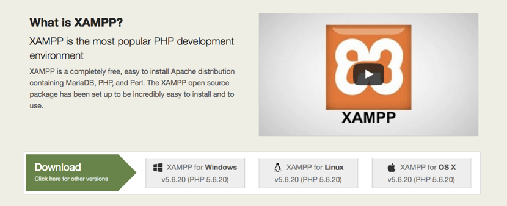

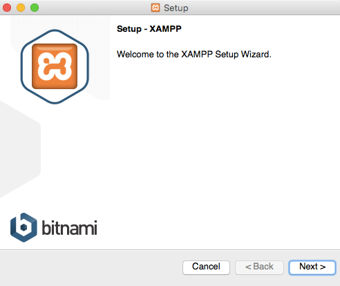

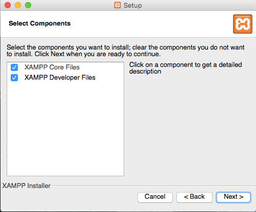

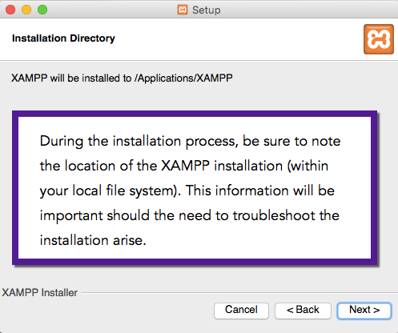

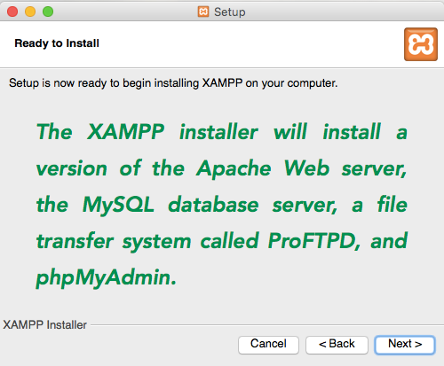

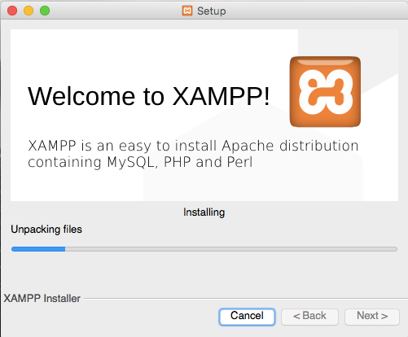

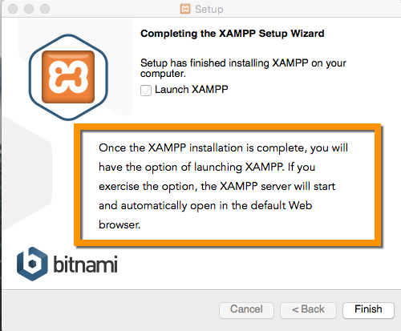

This is the XAMPP Control Panel, running as a desktop application.

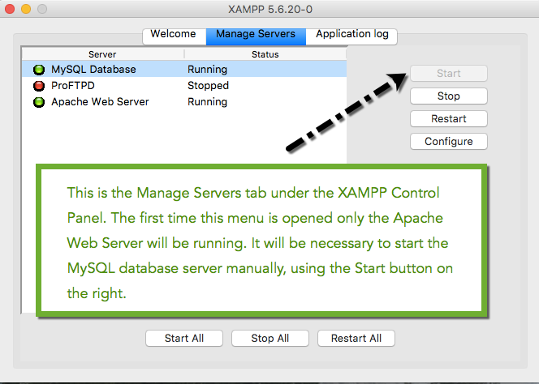

A couple of related notes: phpMyAdmin will be fully functional in the XAMPP configuration only if the MySQL server is running. The ProFTPD application is of incidental importance in the database-oriented exercises, but it will be of vital importance in the event that the XAMPP installation is used subsequently for Web design. 

---

Below is another view of the XAMPP Control Panel. Note that in this instance that FileZilla, Mercury, and Apache Tomcat have been included in this version.

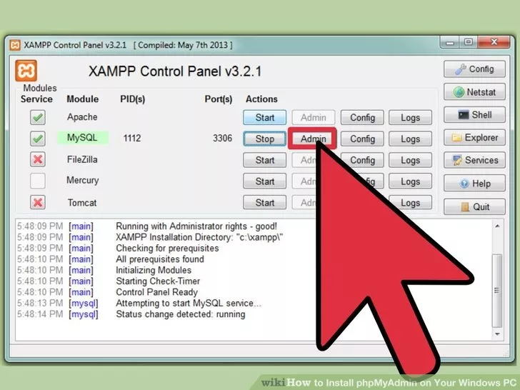

If you are using a Linux system or a virtual machine running a standard Linux distribution such as Debian or Ubuntu, installing phpMyAdmin is a straightforward process. It begins from the command line with this instruction:

`sudo apt-get install phpmyadmin`

(If you're using Ubuntu 7.10 (Gutsy) or later, select Apache2 from the "Configuring phpmyadmin" dialog box.)

To set up under Apache all you need to do is include the following line in /etc/apache2/apache2.conf: 

`Include /etc/phpmyadmin/apache.conf`

Once phpMyAdmin is installed point your browser to `http://localhost/phpmyadmin` to start using it. You should be able to login using any users you've setup in MySQL. If no users have been setup, use admin with no password to login. 

You may also install phpmyadmin from source code. Since this method circumvents the package manager, you will need to install updates yourself. 

To install it from source, open the console and `cd` to the www directory using:

`cd /var/www/`

Then download it using `svn` by writing:

`sudo svn checkout https://phpmyadmin.svn.sourceforge.net/svnroot/phpmyadmin/tags/STABLE/phpMyAdmin phpMyAdmin`

Then cd to phpMyAdmin:

`cd phpMyAdmin`

Create the directory config:

`sudo mkdir config`

Change the permissions of the `config` directory:

`sudo chmod o+rw config`

Navigate to `http://localhost/phpmyadmin/scripts/setup.php` in your Web browser and follow the instructions for setting up phpMyAdmin.

Or you may download the latest stable version of the PhpMyAdmin software at [http://www.phpmyadmin.net/home_page/downloads.php](http://www.phpmyadmin.net/home_page/downloads.php). If you are working from the Linux command line, use the utility called `wget to download phpMyAdmin:

`wget www.phpmyadmin.net/home_page/downloads.php`

Then, extract the archive file on your computer. In the Linux environment, the following command will extract phpMyAdmin to a folder:

`unzip phpMyAdmin-4.6.0-all-languages.zip`

If `unzip` is not installed, the following command will download and install it:

`sudo apt-get install unzip`

The simplest approach to download the file phpMyAdmin-4.6.0-all-languages.zip to `/var/www/html' and extract it there. Then, load the PhpMyAdmin page with your Web browser, using the corresponding URL (for example `http://www.yourdomainname.com/phpMyAdmin/scripts/setup.php`, where you should substitute www.yourdomainname.com with your actual domain name).

### Webmin: an Alternative to phpMyAdmin

**Webmin** is a Web-based system configuration tool for UNIX-like systems, although recent versions can also be installed and run on Windows. With it, it is possible to configure operating system internals, such as users, disk quotas, services or configuration files, as well as modify and control open source apps, such as the Apache HTTP Server, PHP or MySQL.

Webmin is largely based on Perl, running as its own process and Web server. It defaults to TCP port 10000 for communicating, and can be configured to use SSL if OpenSSL is installed with additional required Perl Modules.

Webmin is built around modules, which have an interface to the configuration files and the Webmin server. Webmin can be expanded by installing modules. This makes it easy to add new functionality. It is also possible for a programmer to write plugins for desktop configuration. Webmin allows for controlling many machines through a single interface.

Webmin is released under the BSD license.

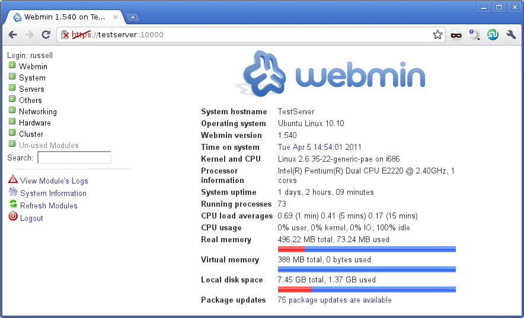

This is the basic Webmin interface above. The interface of the module affording access to the MySQL server is illustrated below.

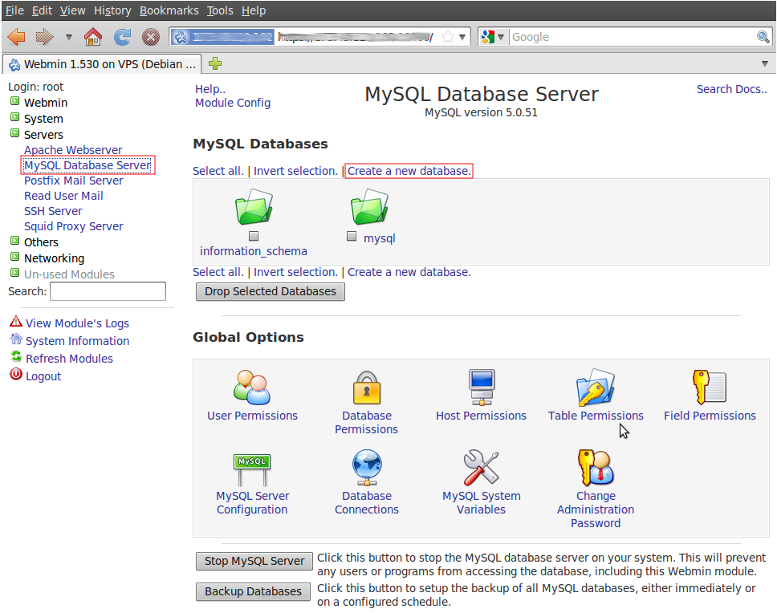

## Logging into phpMyAdmin

